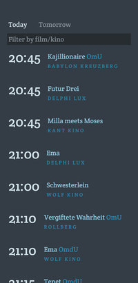

# ourkino

A simple movie showtime listing for a highly curated list of locations. Currently supports showtimes for 🇩🇪 **Berlin**, 🇺🇸 **Chicago**, and 🇺🇸 **Seattle**, because that is where I have resided.

This listing is biased towards independent cinemas. Particularly in Berlin and Seattle, there was no single site that simply listed what films are playing across the subset of kinos that tend to run indie films.

**[ourkino.com](https://ourkino.com)**



The UI displays all upcoming shows in time order, regardless of location. The assumption is that you care more about the when than the where. A filter box enables you to filter by cinema or movie title.

## Building

```shell
go build
```

## Acknowledgements

For the Berlin listings, this relies heavily on the high-quality listing information assembled and presented by [kinoheld](https://www.kinoheld.de/). For the Chicago listings, it uses the showtime feeds from [IMDb](https://www.imdb.com/). For Seattle listings, it uses data from [Elevent](https://getelevent.com) and other bespoke sources.
